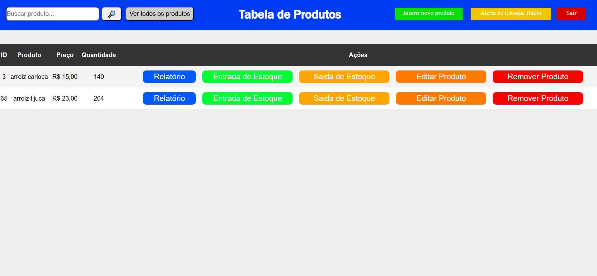

📦 ##Sistema de Controle de Estoque

Sistema de gerenciamento de estoque desenvolvido em PHP, com funcionalidades completas para controle de produtos, usuários, fornecedores, categorias e movimentação de estoque. Possui níveis de acesso diferenciados: usuário comum e administrativo, permitindo uma gestão segura e eficiente.

✅ ##Funcionalidades

👤 ##Usuário Comum

Buscar produtos: pesquisa por nome e exibição de detalhes (quantidade, preço, fornecedor, categoria).

Inserir produto: cadastro de novos produtos com quantidade mínima e máxima.

Editar produto: alterar informações de produtos existentes.

Remover produto: exclusão de produtos do estoque.

Entrada de estoque: registrar a reposição de produtos.

Saída de estoque: registrar a saída ou venda de produtos.

Alerta de estoque baixo: aviso quando o estoque mínimo é atingido.

Relatórios: movimentações e status do estoque.

Imagem da tela do usuário comum:

🛠 ##Usuário Administrativo

Gerenciamento de usuários: inserir, editar, remover e buscar usuários.

Movimentação de estoque: visualização completa do histórico e limpeza de movimentações.

Gerenciamento de fornecedores: cadastrar, editar e remover fornecedores, com validação de CPF e telefone.

Gerenciamento de categorias: cadastrar, editar e remover categorias de produtos.

Controle total do estoque: inserir produtos, registrar entrada/saída e alertas automáticos.

Relatórios administrativos: produtos, movimentações, usuários, fornecedores e categorias.

Imagem da tela administrativa:

🛠 ##Tecnologias e Conceitos Utilizados

PHP 8+ com PDO para conexão com banco de dados.

MySQL como banco de dados.

Arquitetura MVC (Model-View-Controller).

Sessões para feedback e permissões de usuário.

Validação de dados e tratamento de erros.

Modularização e organização em classes e métodos.

📷 ##Demonstração

## Painel de Login

## Painel Principal

▶️ ##Como executar

Clone o repositório:

git clone https://github.com/felipesilvalima/sistema-estoque-php.git

Acesse a pasta do projeto:

cd sistema-estoque-php

Configure seu servidor local (XAMPP, WAMP, Laragon ou Docker) e importe o banco de dados.

Abra o sistema no navegador acessando http://localhost/pasta-do-projeto.

👨‍💻 ##Autor

Felipe Silva Lima
📧 felipesilvalima200@gmail.com

🔗 LinkedIn
