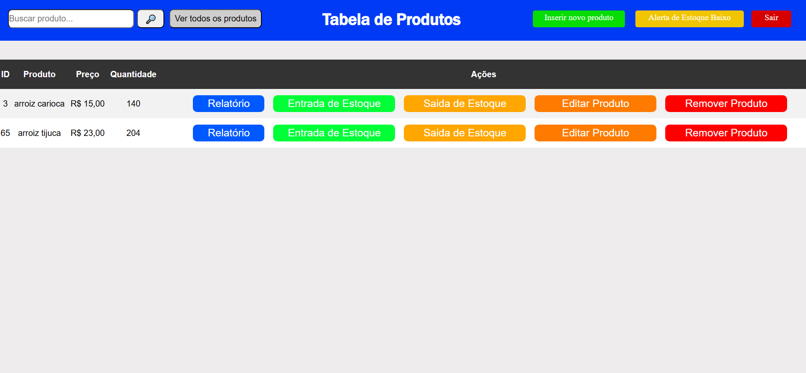

## 📦 Sistema de Controle de Estoque

Sistema de gerenciamento de estoque desenvolvido em PHP, com funcionalidades completas para controle de produtos, usuários, fornecedores, categorias e movimentação de estoque. Possui níveis de acesso diferenciados: usuário comum e administrativo, permitindo uma gestão segura e eficiente.

## ✅ Funcionalidades

## 👤 Usuário Comum

Buscar produtos: pesquisa por nome e exibição de detalhes (quantidade, preço, fornecedor, categoria).

Inserir produto: cadastro de novos produtos com quantidade mínima e máxima.

Editar produto: alterar informações de produtos existentes.

Remover produto: exclusão de produtos do estoque.

Entrada de estoque: registrar a reposição de produtos.

Saída de estoque: registrar a saída ou venda de produtos.

Alerta de estoque baixo: aviso quando o estoque mínimo é atingido.

Relatórios: movimentações e status do estoque.

Imagem da tela do usuário comum:

## 🛠 Usuário Administrativo

Gerenciamento de usuários: inserir, editar, remover e buscar usuários.

Movimentação de estoque: visualização completa do histórico e limpeza de movimentações.

Gerenciamento de fornecedores: cadastrar, editar e remover fornecedores, com validação de CPF e telefone.

Gerenciamento de categorias: cadastrar, editar e remover categorias de produtos.

Controle total do estoque: inserir produtos, registrar entrada/saída e alertas automáticos.

Relatórios administrativos: produtos, movimentações, usuários, fornecedores e categorias.

Imagem da tela administrativa:

## 🛠 Tecnologias e Conceitos Utilizados

PHP 8+ com PDO para conexão com banco de dados.

MySQL como banco de dados.

Arquitetura MVC (Model-View-Controller).

Sessões para feedback e permissões de usuário.

Validação de dados e tratamento de erros.

Modularização e organização em classes e métodos.

## 📷 Demonstração

## Painel de Login

## Painel Principal

## ▶️ Como executar

Clone o repositório:

git clone https://github.com/felipesilvalima/sistema-estoque-php.git

Acesse a pasta do projeto:

cd sistema-estoque-php

Configure seu servidor local (XAMPP, WAMP, Laragon ou Docker).

### 1. Crie o banco de dados

    mysql -u root -p < database/schema.sql
    mysql -u root -p controler_de_estoque < database/seed.sql

O `seed.sql` é opcional e traz dados de exemplo com logins prontos:

| Acesso | Login | Senha |
|---|---|---|
| Usuário comum | felipe@email.com | 123456 |
| Administrador | 12345678901 (CPF) | admin123 |

### 2. Configure as credenciais

Copie o modelo e preencha com o usuário e a senha do seu MySQL:

    cp env.example.php env.php

O `env.php` fica na raiz do projeto, não é versionado (está no `.gitignore`) e
define `DB_HOST`, `DB_NAME`, `DB_CHARSET`, `DB_USER` e `DB_PASSWORD`.

Em produção, prefira um usuário dedicado no lugar do `root`:

    CREATE USER 'estoque'@'localhost' IDENTIFIED BY 'sua_senha';
    GRANT ALL PRIVILEGES ON controler_de_estoque.* TO 'estoque'@'localhost';
    FLUSH PRIVILEGES;

### 3. Publique o projeto como `controler_de_estoque`

O código tem as URLs fixas no formato `/controler_de_estoque/view/...` (são mais
de 30 `header("Location: ...")` e links). Por isso a pasta `app/` precisa
responder nesse caminho. Com o DocumentRoot em `/var/www/html`:

    ln -sfn /caminho/do/projeto/app /var/www/html/controler_de_estoque

O Apache precisa de `Options FollowSymLinks` no diretório (é o padrão do Debian/Ubuntu).

### 4. Acesse

http://localhost/controler_de_estoque/view/login/login.php (usuário comum)

http://localhost/controler_de_estoque/view/loginAdm/login.php (administrador)

## 👨‍💻 Autor

Felipe Silva Lima
📧 felipesilvalima200@gmail.com

🔗 LinkedIn
